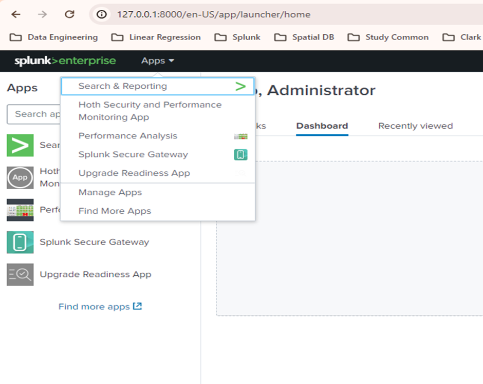
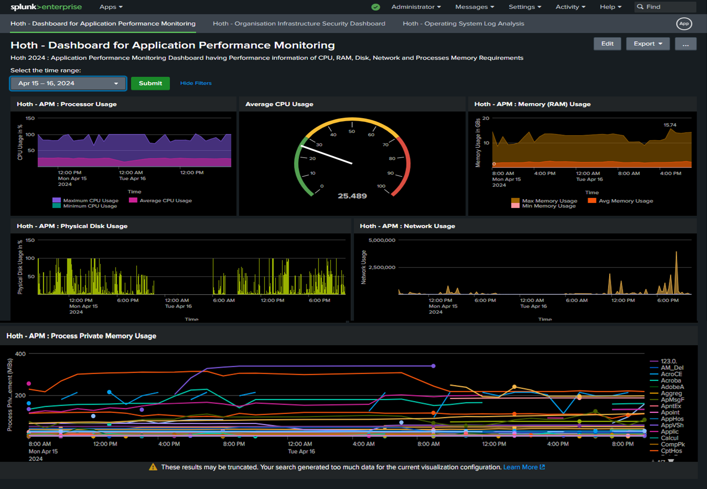
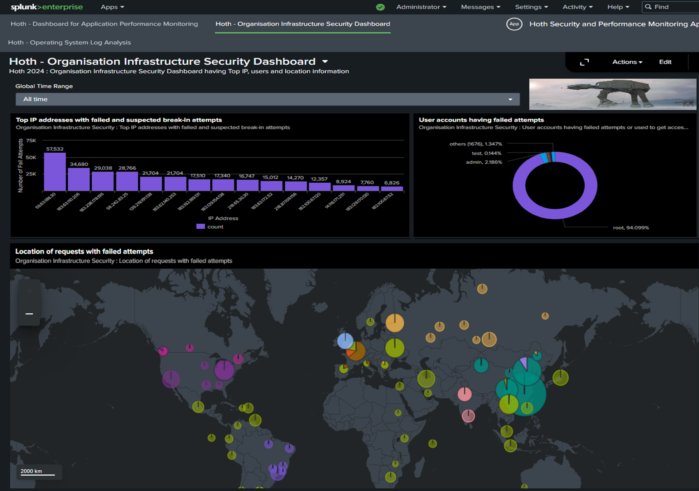
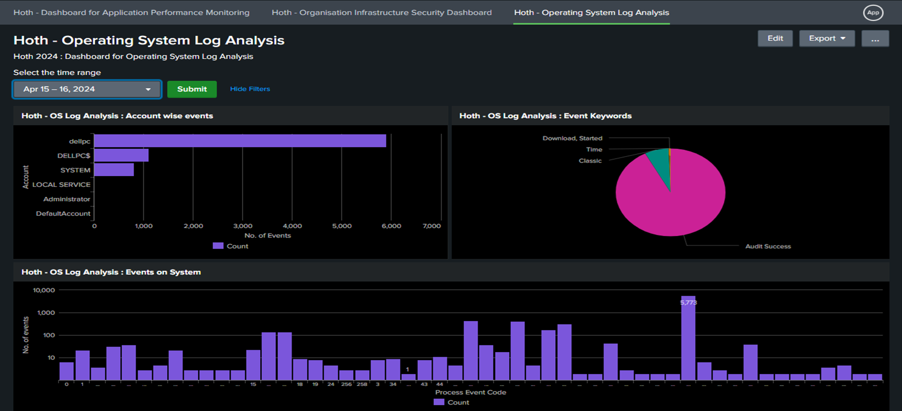

# Security and Performance Monitory through Splunk
## Data Sources and Ingestion
- Windows Performance Matrices (Live Data Ingestion)
  - Processor (in %age Usage)
  - Memory (in Bytes)
  - Logical and Physical disk storage (in Bytes)
  - Network Usage (in Bytes)
  - Processes Private Memory Requirement (in Bytes)
- System Security Logs (SSH connection Logs)
  - Field Extraction
  - IP Address of source system
    ~~~
    ^((\w+\s+\d+\s+\d+:\d+:\d+\s+\w+\s+\w+\[\d+\]:\s+\w+\s+\w+\s+\w+\s+\w+\s+\w+\s+)|((?:[^ \n]* ){9})|((?:[^=\n]*=){6})|(\w+\s+\d+\s+\d+:\d+:\d+\s+\w+\s+\w+\[\d+\]:\s+\w+\s+\w+\s+\w+\s+\w+\s+\w+\s+\w+\s+)|(\w+\s+\d+\s+\d+:\d+:\d+\s+\w+\s+\w+\[\d+\]:\s+\w+\s+\w+\s+\d+\s+\w+:\s+\[\s+\w+\s+\w+\s+\w+\s+\w+\s+\w+\s+)|(\w+\s+\d+\s+\d+:\d+:\d+\s+\w+\s+\w+\[\d+\]:\s+\w+\s+\w+\s+\w+\s+\w+\s+\w+\s+\w+\s+\w+\s+)|((?:[^ \n]* ){10})|((?:[^ \n]* ){7})|((?:[^\.\n]*\.){5}\w+\s+\[))(?P<client_ip_address>\d+\.\d+\.\d+\.\d+)
    ~~~
  - User name for which login attempt is being made
    ~~~
    ^((.* invalid user )|(.* user )|(.*password for )|((?:[^=\n]*=){7}))(?P<user_name>\w+)
    ~~~
- Operating System Logs (Live Data-Stream)
  - Application Logs
  - Security Logs
  - Systems Logs
  - Setup Logs

## Splunk Search Processing Language
- Windows Performance Matrices
  - Processor Usage
    ~~~
    sourcetype="PerfmonMetrics:CPU"
    | bucket _time span=1h
    | stats max(Value) as "Maximum CPU Usage", avg(Value) as "Average CPU Usage", min(Value) as "Minimum CPU Usage" by _time
    ~~~
  - Memory Usage
    ~~~
    sourcetype="PerfmonMetrics:Memory"
    | bucket _time span=1h
    | eval memory_in_gb =  Value/1024/1024/1024
    | stats max(memory_in_gb) as "Maximum Memory Usage", avg(memory_in_gb) as "Average Memory Usage", min(memory_in_gb) as "Minimum Memory Usage" by _time
    ~~~
  - Logical and Physical disk storage (in Bytes)
    ~~~
    union
     [ search sourcetype="PerfmonMetrics:LogicalDisk" | table sourcetype, _time, Value | rename Value as "LogicalDisk"]
     [ search sourcetype="PerfmonMetrics:PhysicalDisk" | table sourcetype, _time, Value | rename Value as "PhysicalDisk" ]
    | stats avg(PhysicalDisk) as "Average Disk Usage" by _time
    ~~~
  - Network Usage (in Bytes)
    ~~~
    sourcetype="PerfmonMetrics:Network" 
    | bucket _time span=5m 
    | stats max(Value) as "Maximum N/W Usage", avg(Value) as "Average N/W Usage", min(Value) as "Minimum N/W Usage" by _time
    ~~~
  - Processes Private Memory Requirement (in Bytes)
    ~~~
    sourcetype="PerfmonMetrics:Process" counter="Private Bytes"
    | eval Bytes_in_mb=round(Value/1024/1024, 2)
    | eval instance=substr(instance, 1, 6)
    | bucket _time span=1h 
    | stats avg(Bytes_in_mb) as Bytes_in_mb by _time, instance
    | eval SH_{instance}=avg(Bytes_in_mb)
    | stats values(SH_*) as * by _time
    ~~~
- System Security Logs
  - Top IP addresses with failed and suspected break-in attempts
    ~~~
    index="hoth_ssh_logs" client_ip_address!=NULL AND (fail* OR BREAK*) 
    | stats count by client_ip_address 
    | sort - count 
    | head 15
    ~~~
  - User accounts having failed attempts
    ~~~
    index="hoth_ssh_logs" user_name!=NULL AND (fail* OR BREAK*) 
    | stats count by user_name 
    | sort – count
    ~~~
  - Location of requests with failed attempts
    ~~~
    index="hoth_ssh_logs" client_ip_address!=NULL AND (fail* OR BREAK*) 
    | iplocation client_ip_address 
    | geostats count by Country
  - Drill Through - History of failed or break-in attempts from specific IP Address
    ~~~
    index="hoth_ssh_logs" client_ip_address!=NULL AND (fail* OR BREAK*)  client_ip_address="59.63.188.30"
    | timechart count
    ~~~
- Operating System Logs
  - Events on System
    ~~~
    index="hoth_win_logs" Keywords!=None
    | stats count As "Count" by EventCode
  - Event Keywords
    ~~~
    index="hoth_win_logs" Keywords!=None
    | stats count by Keywords
    | sort - count
    ~~~
  - Account wise events
    ~~~
    index="hoth_win_logs"
    | stats count as "Count" by Account_Name
    | sort - Count
## Splunk Visualizations:
### Splunk App

### Splunk Dashboard 1

### Splunk Dashboard 2

### Splunk Dashboard 3

# Important Links
- [Steps for Data Ingestion (Windows real-time performance matrices and Upload method) and Regular Expressions Used](./Data_Ingestion_RealTime_Upload_and_Regular_Expression.pdf)

